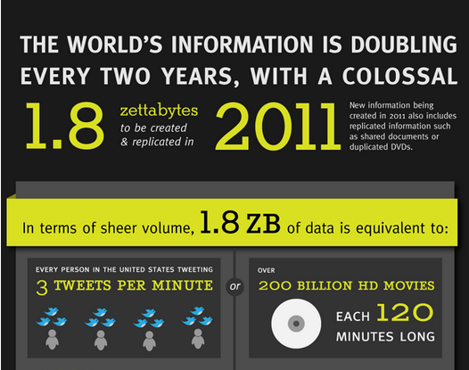
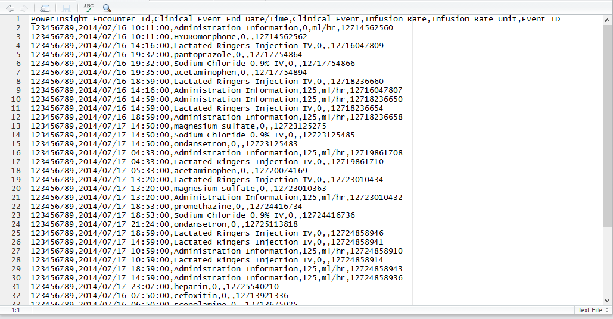
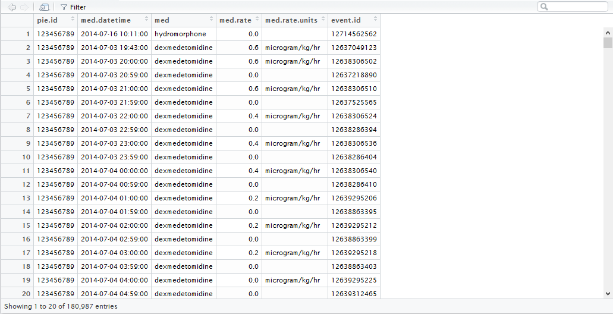
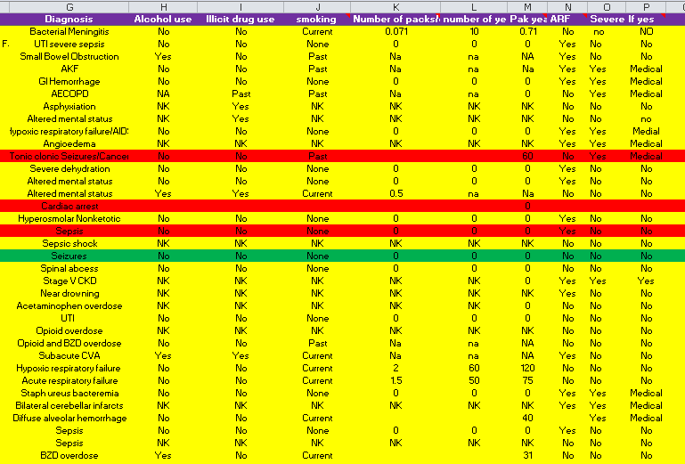

Working with Data
========================================================
author: Brian Gulbis
date: April 4, 2016

Big Data
========================================================



<small>http://mashable.com/2011/06/28/data-infographic</small>

Big Data
========================================================

* 90% of the world's data was generated over the past two years
* Data comes from everywhere: 
    - Sensors used to gather climate information
    - Posts to social media sites
    - Digital pictures and videos
    - Purchase transaction records
    - Cell phone GPS signals
    - Electronic Medical Records

<small>http://www-01.ibm.com/software/data/bigdata/what-is-big-data.html</small>

Data in Research
========================================================

* Data is the second most important thing when doing research
* The question being asked is the most important
    - Data may limit or enable certain questions
    - Having data does not matter if you are not asking the right question
* Big or small, you need the right data

Sources of Data
========================================================

* Manual collection
* Hospital / system databases
    - EDW, TheraDoc, Cardinal DCOA
* Organizations
    - UHC CDB/RM
* Public Data
    - Hospital Compare, Registries

Categories of Data
========================================================

* Raw data
    - Original source of data
    - Hard to use for analysis
* Processed (tidy) data
    - Ready for analysis
    - Performed merging, sub-setting, transforming, etc. on data
    - All processing steps should be recorded

Data Preparation
========================================================

* Estimated that 80% of data analysis is spent on cleaning and preparing data
* Major limiting factor for many "amateur" researchers
* Advantages of adequately preparing data
    - Facilitates data analysis
    - Allows data to be input into various anlaysis tools
    - Some analysis cannot be performed without transforming raw data

<small>Dasu T, Johnson T (2003). Exploratory Data Mining and Data Cleaning. Wiley-IEEE.</small>

Raw Data Example
========================================================




* Contains 1,440,702 rows of data
* Takes up 81 MB of space

Tidy Data Example
========================================================




* Contains only the 180,987 rows of data that we want
* Column names more descriptive

Most Common Problems with Messy Data
========================================================

* Column headers are values, not variable names
* Multiple variables are stored in one column
* Variables are stored in both rows and columns
* Multiple types of observational units are stored in the same table
* A single observational unit is stored in multiple tables

<small>Wickham, H. Tidy data. J Stat Software 2014; 59 (10)</small>

Principles of Tidy Data
========================================================

* Each variable should be in one column
    - Data within the column should be of the same type
* Each observation of that variable should be in a different row
* Variables of different “kinds” should be in different tables
    - Each table should be stored in it’s **own file**
    - Multiple tables should have a column which allows them to be linked

<small>Wickham, H. Tidy data. J Stat Software 2014; 59 (10)</small>

Principles of Tidy Data
========================================================

* Variable names should be stored in the first row
    - Names should be descriptive and readable
    - Use minimal abbreviations
    - Avoid having spaces in name
        + Good: med_name, sedativeRate
        + Bad: clnevnt, ce, clinical event

<small>Wickham, H. Tidy data. J Stat Software 2014; 59 (10)</small>

Data Processing Tools
========================================================

* Basic
    - Spreadsheets (Excel, etc.)
* Intermediate
    - Advanced spreadsheet functions
    - Databases (Access, MySQL, etc.)
* Advanced
    - Programming languages (R, Python, Julia, etc.)

Data Manipulation
========================================================

* Filter
    - Remove observations based on some condition
        + Remove patients who are < 18 years old
        + Find all patients admitted between January 1, 2015 and December 31, 2015
* Transform
    - Add or modify variables
        + Convert all weights to same units
        + Calculating CrCl

<small>Wickham, H. Tidy data. J Stat Software 2014; 59 (10)</small>

Data Manipulation
========================================================

* Aggregate
    - Collapse multiple values into a single value
        + Mean of a group of observations
        + Total number of patients who experienced an adverse event
* Sort
    - Change the order of observations
        + From highest to lowest
        + From first to last

<small>Wickham, H. Tidy data. J Stat Software 2014; 59 (10)</small>

Sharing Data
========================================================

* For faster analysis turnaround, include the following
    - Raw data
    - Tidy data
    - Code book
    - Instruction list

<small>https://github.com/jtleek/datasharing</small>

Code Book
========================================================

* Describes each variables in the data set
    - Units of measure
* Provides information about the summary choices made
* Includes information about the experimental study design used

<small>https://github.com/jtleek/datasharing</small>

Instruction List
========================================================

* Step-by-step instructions which describe how to
    - Process raw data into tidy data 
    - Analyze tidy data and produce final results
* Results should be reproducible by others
    - Reviewers, readers, future self, etc.
    - Given your raw data, they should be able to replicate the analysis performed 

<small>https://github.com/jtleek/datasharing</small>

Data Types
========================================================

* Continuous
* Ordinal and Categorical
    - In general, avoid coding as numbers
        + Sex should be "female" or "male"
        + Hypertension should be "true" or "false"
    - Will avoid coding errors when entering data
    - Will avoid confusion when interpreting data
    - Some programs may interpret numbers as continuous data

<small>https://github.com/jtleek/datasharing</small>

Missing Data
========================================================

* Missing data should be coded as NA
* Censored data
    - Know something about the missing data
        + Lab value outside detectable range
    - Still coded as NA, but add a new column which indicates the data is censored

<small>https://github.com/jtleek/datasharing</small>
    
File Formats for Sharing Data
========================================================

* Excel
    - Usually works, but not ideal
        + May be compatibility issues with the analysis tool
        + Calculated cells may not be read correctly
    - All data should be in a single worksheet
    - No columns or cells should be highlighted
    - No macros should be used

<small>https://github.com/jtleek/datasharing</small>

File Formats for Sharing Data
========================================================

* Text Files
    - Examples: CSV, TAB-delimited
    - Highest degree of compatibility
    - Only the information in "cells" is retained

<small>https://github.com/jtleek/datasharing</small>

Sharing Data Example
========================================================



Sharing Data Example Examined
========================================================


* Diagnosis
    - Number of distinct values: 172
* Alcohol Use


```
   0   NA   nk   Nk   NK   no   nO   No   NO Past  yes  Yes NA's 
   2    1   32    4   91  108    1  133    3    1   17   54    8 
```

* Number of packs/day
    - Contains numeric and non-numeric data
* Column P heading: "If yes"
    - Unclear what this data represents

Data Collection and Storage
========================================================

* Design with the next step in mind
    - Keep data collection form and data storage tool
    - Design data collection form to facilitate getting data into storage
    - Design data storage to facilitate getting into analysis tool
* Excel should be used primarily for data storage
    - Requires a lot of scrolling to visualize all data points
    - Consider creating a form which links to a spreadsheet for data collection
* Do not include data aggregation in data storage
    - Calculated columns may not import correctly into analysis tools
