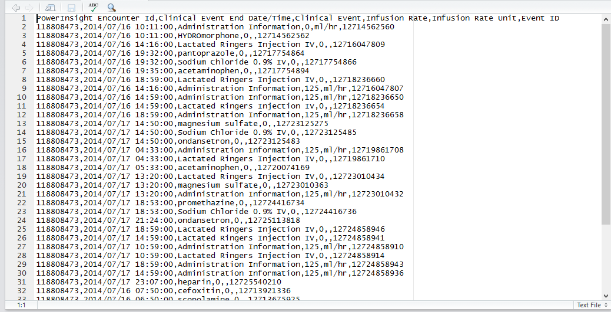

Working with Data
========================================================
author: Brian Gulbis
date: April 4, 2016

Big Data
========================================================


<small>http://mashable.com/2011/06/28/data-infographic</small>

Big Data
========================================================

* 90% of the world's data was generated over the past two years
* Data comes from everywhere: 
    - Sensors used to gather climate information
    - Posts to social media sites
    - Digital pictures and videos
    - Purchase transaction records
    - Cell phone GPS signals
    - Electronic Medical Records

<small>http://www-01.ibm.com/software/data/bigdata/what-is-big-data.html</small>

Data in Research
========================================================

* Data is the second most important thing when doing research
* The question being asked is the most important
    - Data may limit or enable certain questions
    - Having data does not matter if you are not asking the right question
* Big or small, you need the right data

Sources of Data
========================================================

* Manual collection
* Hospital / system databases
    - EDW, TheraDoc, Cardinal DCOA
* Organizations
    - UHC CDB/RM
* Public Data
    - Hospital Compare, Registries

Categories of Data
========================================================

* Raw data
    - Original source of data
    - Hard to use for analysis
* Processed data
    - Ready for analysis
    - Performed merging, sub-setting, transforming, etc. on data
    - All processing steps should be recorded

Data Preparation
========================================================

* Estimated that 80% of data analysis is spent on cleaning and preparing data
* Major limiting factor for many "amateur" researchers

<small>Dasu T, Johnson T (2003). Exploratory Data Mining and Data Cleaning. Wiley-IEEE.</small>

Raw Data Example
========================================================

* MUE medication administration data




* Contains 1,440,702 rows of data
* Takes up 81 MB of space

Tidy Data Example
========================================================


* Contains only the 180,987 rows of data that we want
* Column names more descriptive

Principles of Tidy Data
========================================================

* Each variable should be in one column
    - Data within the column should be of the same type
* Each observation of that variable should be in a different row
* Variables of different “kinds” should be in different tables
    - Each table should be stored in it’s **own file**
    - Multiple tables should have a column which allows them to be linked

<small>Wickham, H. Tidy data. J Stat Software 2014; 59 (10)</small>

Principles of Tidy Data
========================================================

* Variable names should be stored in the first row
    - Names should be descriptive and readable
    - Use minimal abbreviations
    - Avoid having spaces in name
        + Good: med_event, sedativeRate
        + Bad: clnevnt, ce, clinical event

<small>Wickham, H. Tidy data. J Stat Software 2014; 59 (10)</small>

Data Processing Tools
========================================================

* Basic
    - Spreadsheets (Excel, etc.)
* Intermediate
    - Advanced spreadsheet functions
    - Databases (Access, MySQL, etc.)
* Advanced
    - Programming languages (R, Python, Julia, etc.)

Sharing Data
========================================================

* For faster analysis turnaround, include the following
    - Raw data
    - Tidy data
    - Code book describing each variable
    - List of instructions describing how you went from raw data to tidy data

<small>https://github.com/jtleek/datasharing</small>

Code Book
========================================================

* Information about the variables
    - Units of measure
* Information about the summary choices made
* Information about the experimental study design used

<small>https://github.com/jtleek/datasharing</small>

Data Types
========================================================

* Continuous
* Ordinal
* Categorical
* Missing
    - Should be coded as NA
* Censored
    - Know something about the missing data
        + Lab value outside detectable range
    - Still coded as NA, but add a new column which indicates the data is censored

<small>https://github.com/jtleek/datasharing</small>
    
File Formats for Sharing Data
========================================================

* Excel
    - Usually works but not ideal
    - All data should be in a single worksheet
    - No columns or cells should be highlighted
    - No macros should be used
* Text Files
    - Examples: CSV, TAB-delimited
    - Highest degree of compatibility
    - Only the information in "cells" is retained

<small>https://github.com/jtleek/datasharing</small>

Sharing Data Example
========================================================


Sharing Data Example Examined
========================================================


* Diagnosis
    - Number of distinct values: 172
* Alcohol Use


```
   0   NA   nk   Nk   NK   no   nO   No   NO Past  yes  Yes NA's 
   2    1   32    4   91  108    1  133    3    1   17   54    8 
```

* Number of packs/day
    - Contains numeric and non-numeric data
* Column P heading: "If yes"
    - Unclear what this data represents
